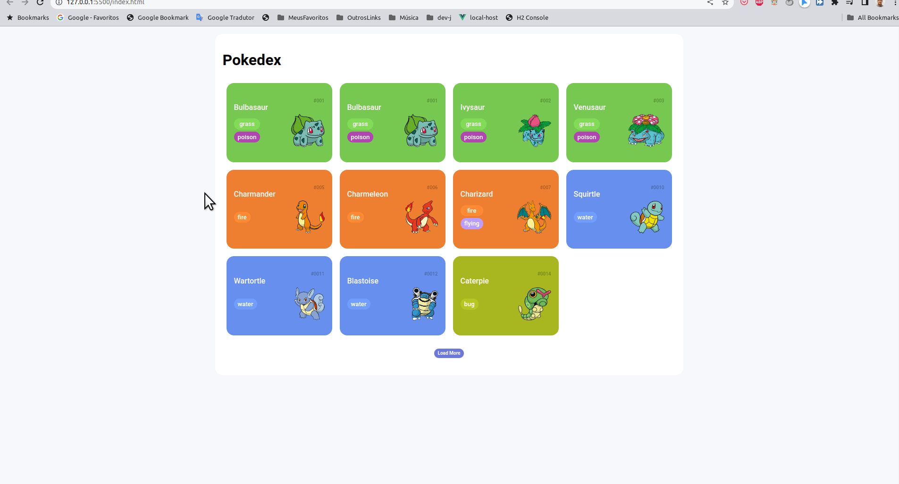

# Projeto Pokedex

Desenvolvido com HTML  CSS e JS
Estudos sobre desenvolvimento web com sua tecnologias fundamentais na DIO
O projeto tambêm se comunica com API externa, usando recurso nativo do javascript fetch API.

